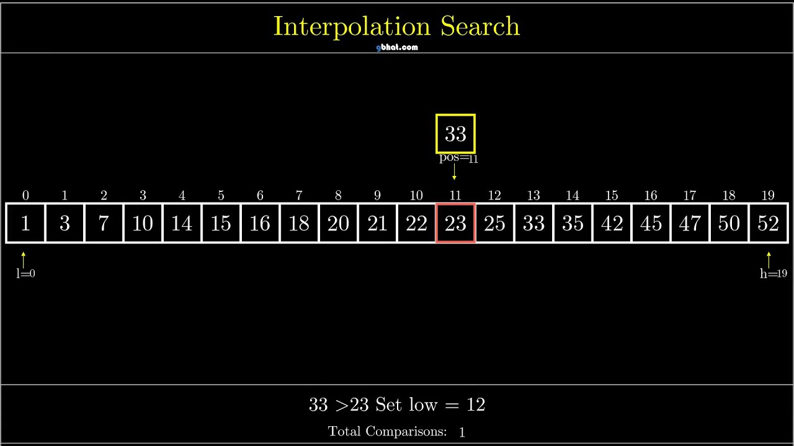
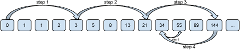
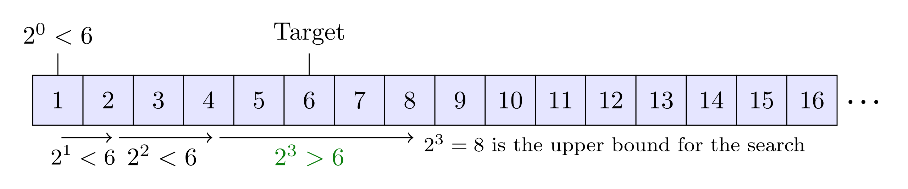

# Searching

## Introduction

In computer science, data is often formatted into lists or similar data structures.
  These lists are often queried for specific points.  Depending on how the data is 
arranged, there are different methods on how to do so.  Approaches focus on how best to 
find the requested data - efficiency, speed, and thoroughness.  The approaches generally 
fall into two categories:
- Sequential search: The list is traversed sequentially and every element is checked.
- Interval search: These algorithms are specifically designed for searching in sorted data 
structures.  These types of searching algorithms are much more efficient than sequential 
searches, since they can skip elements in their search.

Each searching algorithm will be discussed within its own section.

---

## Sequential Search
Sequential searches maintain an advantage over interval searches in that they can work on 
unsorted lists, while interval searches are restricted to operations on sorted lists.

### Linear Search
Linear search is the easiest search algorithm.  It begins at one end and goes through 
each element of the list until the desired element is found, otherwise the search 
continues until the end of the list.  If found, the index or the object is returned.  If 
not, -1 or `null` is returned.  Because it attempts every possibility until it finds the 
answer, it is also known as a brute-force search.

Given an array of length *n*, it has a time complexity of O(n) and requires an auxiliary 
space of O(1).

### Linear Search Recursive Approach
This approach uses recursion, and is solved in the following fashion:
- If the size of the array is 0, return -1, indicating the element is not found.  This can 
also be treated as the base condition of the recursive call.
- Otherwise, check if the element at the current index in the array is equal to the key or 
not.
  - If it is equal, return the index of the key.

This approach has a time complexity of O(n) and auxiliary space of O(n), due to its using 
recursive stack space.  Because of this added complexity and inefficiency, you will not be 
implementing this approach.

---

## Interval Search
All interval searches must operate on sorted arrays.  While this does cost time initially 
to sort the array, these algorithms perform much faster than sequential searches.

### Binary Search
Binary search works be repeatedly dividing the search area in half.  It begins by checking 
the midpoint of the sorted array against the key.  If the values match, it returns 
immediately.  However, if the key is higher than the value, the algorithm then searches 
the midpoint of the subarray to the right of the failed check.  If lower, it searches to 
the left.  (These subarrays are similar to the ones discussed in interpolation sort.  They 
remain as part of the main array, but are viewed as existing between positional 
parameters.)  If the key is never found, -1 or `null` is returned, depending on the case.

The binary search algorithm can be implemented two ways: the iterative method, which uses 
a loop (usually `while`) to modify the ends of the array, and the recursive method, which 
calls itself using the modified ends.  The methods provide a tradeoff:
- The iterative method uses a single loop and does not cost any additional space, but it 
is more difficult to read and debug.
- The recursive method adds a call process to the stack each time it is called; however, 
it is easier to understand and debug.

Both methods have a time complexity of O(log n).  The iterative method uses auxiliary 
space of O(1), while the recursive method uses auxiliary space of O(log n).

When coding the recursive approach, it is not uncommon to have a method masking the 
auxiliary method that actually performs the work.  For example, the user may call 
`binarySearch(key, array)`, while that method calls `binarySearchAuxiliary(key, array, 
start, end)` with the `start` parameter initialized to 0 and `end` to the end of the array.
(Of course, some languages allow default parameter values, so an auxiliary method may not 
be necessary.)

### Interpolation Search
Interpolation search is an improvement over binary search in cases where the sorted array 
contains uniformly distributed values.  Interpolation constructs new data points within 
the range of a discrete set of known data points.  While binary search always goes to the 
middle element to check, interpolation search may go to different locations according to 
the value of the key being searched.  For example, if the value of the key is closer to 
the last element, interpolation search is likely to start the search toward the end side.  
The algorithm works much like the way we search for a word in the dictionary.

To find the position to be searched, it uses the formula 

where *x* is the key to be found, *lo* is the lowest index to be searched, and *hi* is the 
highest index to be searched.

The algorithm operates as follows:
1. Calculate the position of *pos* using the probe positional formula.
2. If it is a match, return the index of the item, and exit.
3. If the item is less than *arr[pos]*, calculate the probe position of the left subarray.  
Otherwise, calculate the same in the right subarray.
4. Repeat until a match is found or the subarray reduces to zero.

Interpolation search has a time complexity of O(log2(log2 n)) for 
the average case and O(n) for the worst case, and an auxiliary space complexity of O(1).

### Jump Search
Like binary search, jump search is a searching algorithm for sorted arrays.  The basic idea 
is to check fewer elements (than linear search) by jumping ahead by fixed steps or skipping 
some elements in place of searching all elements.  It is better than linear search, but 
worse than binary search.  (Binary is better than jump, but jump has the advantage that we 
traverse back only once, while binary may require up to O(log n) jumps, such as in a situation 
where the element to be searched is the smallest element or just bigger than the smallest.  
So in a situation where binary search is costly, we use jump search.)

The optimal step size *m* is √(n), where *n* is the length of the array.  Jump search looks 
at indexes arr[0], arr[m], arr[2m]...arr[km], where the value at arr[km] is greater than the 
search key.  It then backtracks to arr[(k-1)m]+1 and performs a linear search to find the 
correct element.

Jump search has a time complexity of O(√(n)) (where the optimal step size is used), and 
uses an auxiliary space of O(1).

### Exponential Search
The name of this searching algorthm may be misleading as it works in O(log n) time.  The name 
comes from the way it searches an element.  Exponential search involves two steps:
1. Find the range where the element is present.
2. Do a binary search in the above found range.

Exponential binary search is particularly useful for unbounded searches, where the size of the 
array is infinite.  It works better than binary search for bounded arrays, and also where the 
element to be searched is closer to the first element.

The idea is to start with subarray size 1, compare its last element with *key*, then try size 
2, then 4, then 8, and so on until the last element of a subarray is not greater.  (The size 
searched is 2*i*, where *i* is the iteration number, starting at zero.  The index 
can be initialized to 1 and doubled each iteration.)  Once we find an index *i* that is 
greater than *key*, we know the element must be present between *i*/2+1 and *i*-1.  (We know 
it is greater than *i*/2 because we could not find a greater value in the previous iteration, 
and we can eliminate both ends because the first is too small and the latter is too large.)  
Binary search is then performed on the ensuing subarray to find the element.

Exponential search has a time complexity of O(log n).  Its auxiliary space depends on whether 
binary search is implemented using recursion (O(log n) space) or iteration (O(1) space).

---

### Assignment
Program each of the searching algorithms.  These can be run against the lists in `arrays.py`.
  Perform searches for numbers that exist and don't exist within the various lists.  Discover 
when specific algorithms are more efficient that others in certain cases.

---

### Resources
`arrays.py` contains the lists to be used for the searches.  Each list has its elements 
distributed in a different way:
- interpolation list - elements have a roughly uniform distribution
- exponential list - elemental values are closer toward the beginning of the list, and the 
difference between elements can increase the further the list progresses
- fragmented list - elements were generated in different series; each series has a different 
range gap between elements